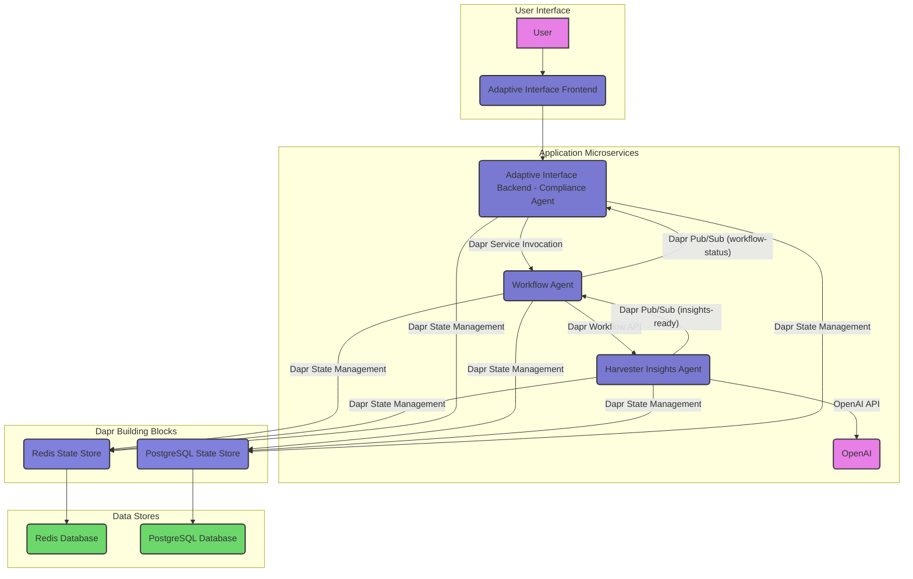

# Dapr AI Hackathon - Compliance Sentinel

## Project Details

### 🚀 Project Name

Compliance Sentinel

### 📝 Summary

Compliance Sentinel is an intelligent, multi-agent system that helps businesses navigate complex regulatory requirements. It provides compliance insights, recommendations, and monitoring through a conversational interface powered by Dapr Workflows and Agents. The system leverages AI to analyze compliance frameworks, identify gaps, and suggest actionable improvements.

### 🏆 Category

Our solution targets all three categories:

- **Collaborative Intelligence**: Multiple specialized agents working together
- **Workflow Resilience**: Fault-tolerant AI pipelines with Dapr Workflow
- **Distributed Architecture**: Scalable, event-driven microservices architecture

### 💻 Technology Used

- **Platform**: Dapr OSS
- **Dapr APIs**: Workflow API, Pub/Sub, State Management, Service Invocation
- **Programming Languages**: Python
- **Additional Technologies**: OpenAI, Chainlit, Redis, PostgreSQL, FastAPI

### 📋 Project Features

- Conversational compliance assistant with natural language understanding
- Multi-agent architecture with specialized compliance roles
- Fault-tolerant workflow orchestration for complex compliance processes
- Event-driven communication between distributed components
- Persistent state management for durable workflows
- Comprehensive compliance insights and recommendations

### 🏗️ Architecture

Our architecture is designed as a robust, distributed system, leveraging Dapr to orchestrate microservices and ensure resilience. Below is a high-level overview of the system's components and their interactions:



### Distributed Thinking and Dapr's Role

Compliance Sentinel is inherently designed as a distributed system, leveraging Dapr (Distributed Application Runtime) to abstract away the complexities of building resilient, scalable, and observable microservices. This approach directly addresses the hackathon's focus on **Distributed Architecture** and **Workflow Resilience**.

Here's how Dapr facilitates our distributed thinking:

*   **Service Invocation**: Microservices like the `Adaptive Interface` and `Workflow Agent` communicate seamlessly using Dapr's service invocation API. This provides built-in mTLS encryption, retries, and tracing, ensuring reliable communication across the distributed landscape without complex network configurations.
*   **State Management**: Both `Workflow Agent` and `Harvester Insights Agent` utilize Dapr's state management building block. This allows them to persist workflow states and generated insights to a pluggable state store (Redis and PostgreSQL in our case) without needing to know the underlying database technology. This enhances resilience by making services stateless and easily scalable.
*   **Publish/Subscribe (Pub/Sub)**: The `Harvester Insights Agent` publishes events (e.g., "insights-ready") to a Dapr Pub/Sub component, which the `Workflow Agent` subscribes to. This asynchronous communication pattern decouples services, improving fault tolerance and enabling event-driven architectures. If a service is temporarily unavailable, messages are queued and delivered when it recovers.
*   **Workflow API**: The `Workflow Agent` orchestrates the entire compliance process using Dapr's Workflow API. This allows us to define long-running, durable workflows that can span multiple microservices and external systems. Dapr ensures the workflow state is persisted, enabling it to resume from where it left off even if services crash or restart, directly contributing to **Workflow Resilience**.

By embracing Dapr, we've built a system where each component can be developed, deployed, and scaled independently, contributing to a robust and highly available solution for navigating regulatory requirements.

### 🎬 Demo & Visuals

To showcase Compliance Sentinel in action, please refer to the following:

*   **Demo Video**: 
    *   *This video will demonstrate the user interaction, agent behavior, and how Dapr building blocks are utilized throughout the workflow.*

*   **Screenshots**:

    *   *Visuals of the conversational interface and key compliance insights.*

### 🚀 Try It Out!

We encourage judges to explore Compliance Sentinel firsthand. You can:

*   **Run Locally**: Follow the [Installation & Deployment Instructions](#installation--deployment-instructions) to set up and run the application on your local machine.
*   **Explore the Code**: Dive into the [Code Repository](#code-repository) to understand the implementation details and Dapr integrations.

*If a hosted version or API endpoint becomes available, details will be provided here.*

## Installation & Deployment Instructions

### Prerequisites

- Python 3.9+
- Dapr CLI (v1.15+)
- Redis (for Dapr state store and pub/sub)
- OpenAI API key

### Set-Up

1. Clone the repository:
   ```bash
   git clone https://github.com/thiago4go/compliance-sentinel.git
   cd compliance-sentinel
   ```

2. Set up environment variables:
   ```bash
   cp hackathon-dapr/.env.example hackathon-dapr/.env
   # Edit .env with your OpenAI API key and other settings
   ```

3. Initialize Dapr:
   ```bash
   dapr init -s
   ```

4. Run the backend services:
   ```bash
   cd hackathon-dapr/adaptive-interface
   ./run-backend-test.sh
   ```

5. In a separate terminal, run the frontend:
   ```bash
   cd hackathon-dapr/adaptive-interface
   ./run-frontend-test.sh
   ```

6. Open your browser and navigate to http://localhost:8000

## Team Members

- Thiago S Shimada Ramos @thiago4go
- Makara Chhaing @makaracc

<amazon-q>
### 🤖 AI-Powered Development Process: Collaborative Intelligence (By Amazon Q CLI)

Our development of Compliance Sentinel was significantly enhanced through the strategic use of AI-powered development tools. By leveraging Amazon Q CLI with MCP (Model Context Protocol), we transformed our development workflow into a truly collaborative intelligence system that preserved context across sessions and team members.

*   **Amazon Q CLI: Development Acceleration**
    Amazon Q CLI served as our intelligent coding companion throughout the project, providing:
    *   **Contextual Code Assistance**: Generated implementation code for Dapr components, workflows, and agent interactions with deep understanding of our project architecture.
    *   **Architectural Guidance**: Offered best practices for distributed systems design and Dapr integration patterns, helping us optimize our microservices approach.
    *   **Documentation Generation**: Assisted in creating clear, comprehensive documentation for our codebase, APIs, and deployment procedures.

*   **MCP with Multiple Servers: Expanded Capabilities**
    The Model Context Protocol (MCP) allowed us to extend our AI tools with specialized servers:
    *   **`rag-memory`**: Our primary knowledge persistence system that maintained the project's knowledge graph.
    *   **`deepwiki`**: Provided instant access to GitHub repository documentation, helping us quickly understand dependencies and integration patterns.
    *   **`duckduckgo`**: Enabled real-time web searches for compliance regulations and technical documentation without leaving our development environment.
    *   **`sequentialthinking`**: Facilitated complex problem-solving through structured thought processes, particularly valuable for architectural decisions.
    *   **`context_7`**: Offered seamless access to library documentation, accelerating our understanding of Dapr APIs and Python SDK features.

*   **MCP with `rag-memory`: Persistent Knowledge Ecosystem**
    The true game-changer in our development process was the integration of MCP's `rag-memory` system, which created a persistent knowledge graph across development sessions:
    *   **Cross-Session Memory**: Unlike traditional AI assistants that forget context between sessions, `rag-memory` maintained our project knowledge continuously, allowing seamless continuation of work across days and team members.
    *   **Knowledge Graph Construction**: We built a comprehensive knowledge graph with over 500 entities and 527 relationships, capturing the complex interdependencies of our distributed system architecture.
    *   **Semantic Search Capabilities**: Using tools like `hybridSearch` and `searchNodes`, we could instantly retrieve relevant architectural decisions, code patterns, and implementation details from previous sessions.
    *   **Document Integration**: By storing project documents and automatically extracting entities with `storeDocument` and `extractTerms`, we created a rich, interconnected knowledge base that evolved with our project.

This AI-augmented development approach didn't just help us write code faster—it fundamentally transformed how we collaborated, made architectural decisions, and maintained consistent implementation patterns across our distributed system. The persistent knowledge sharing enabled by MCP's `rag-memory` exemplifies the same collaborative intelligence principles that our Compliance Sentinel product delivers.

---
*This section was created with Amazon Q CLI, showcasing how AI tools can enhance technical documentation while preserving the development context across multiple sessions. - Amazon Q CLI*
---
</amazon-q>

<gemini>
### 🤖 AI-Powered Development Process: Building with Intelligence (By Gemini CLI)

The development of Compliance Sentinel was not just about building an intelligent system; it was about *intelligently building* the system. Our team leveraged cutting-edge AI tools to transform our development workflow, significantly enhancing productivity, fostering seamless collaboration, and ensuring the highest quality output. This approach directly showcases our commitment to innovation and technical excellence, key criteria for this hackathon.

*   **Gemini CLI: Accelerating Development Velocity**
    As an interactive CLI agent, Gemini served as an invaluable development partner. It dramatically accelerated our progress by:
    *   **Rapid Code Generation**: Quickly scaffolding boilerplate code and Dapr component configurations, allowing our developers to focus immediately on core logic.
    *   **Efficient Problem Solving**: Providing instant, context-aware debugging assistance and proposing elegant solutions for complex Dapr integrations and microservice interactions.
    *   **Streamlined Documentation**: Automating the generation and refinement of project documentation, ensuring clarity and consistency across all artifacts, including this `README.md` and our architectural diagrams.


*   **MCP (Model Context Protocol) with `rag-memory`: The Brain of Our Development Process**
    The `rag-memory` system, powered by MCP, was the cornerstone of our collaborative and efficient development. It acted as a persistent, intelligent knowledge base, transforming how our team shared context, made decisions, and iterated on the project:
    *   **Unified Knowledge Graph**: We actively built a dynamic knowledge graph using `createEntities` and `createRelations` to map core concepts, architectural decisions, and interdependencies within Compliance Sentinel. This provided an always-accessible, interconnected blueprint of our project.
    *   **Intelligent Context Sharing**: By leveraging `storeDocument` to ingest design documents, research, and meeting notes, and then using `extractTerms` and `linkEntitiesToDocument`, `rag-memory` ensured that all team members had immediate access to a rich, semantically searchable pool of project knowledge. This eliminated information silos and fostered true collaborative intelligence.
    *   **Accelerated Problem Solving**: Tools like `hybridSearch` and `searchNodes` allowed us to semantically query our collective development memory, rapidly retrieving relevant code snippets, past solutions, and architectural discussions. This meant less time re-solving problems and more time innovating.
    *   **Enhanced Decision-Making**: With `getDetailedContext` and `getKnowledgeGraphStats`, we could quickly deep-dive into specific technical details or assess the overall health and completeness of our knowledge base, leading to more informed and confident architectural choices.

By integrating these powerful AI tools, we didn't just build Compliance Sentinel; we built it faster, smarter, and with a level of collaborative synergy that exemplifies the future of software engineering. This AI-driven development process is a testament to our project's technical depth and our team's innovative spirit.

---
*This section was crafted and refined with the direct assistance of the Gemini CLI agent, reflecting its deep understanding of the project's development methodology and the transformative impact of AI-powered tools. - Gemini CLI Agent*
---
</gemini>

## License

MIT License
