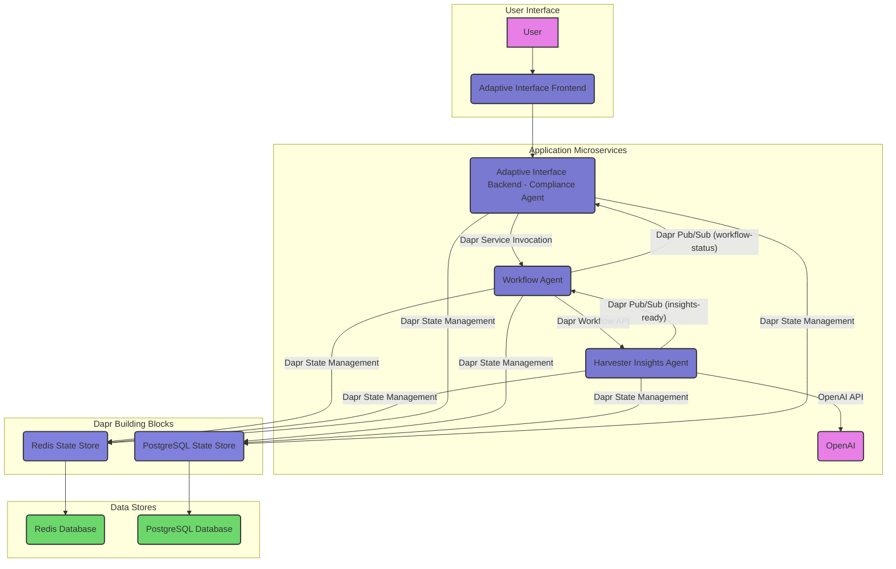

# Compliance Sentinel - Intelligent Compliance Assistant

Compliance Sentinel is an intelligent, multi-agent system that helps businesses navigate complex regulatory requirements through a conversational interface powered by Dapr Workflows and Agents.

## 🌟 Vision

Our vision is to create a comprehensive compliance assistant that leverages the power of AI and distributed systems to help businesses:

- **Understand** complex regulatory requirements across different frameworks (GDPR, ISO 27001, etc.)
- **Identify** compliance gaps in their current processes
- **Recommend** actionable steps to improve compliance posture
- **Monitor** ongoing compliance status through a conversational interface

By combining multiple specialized agents with Dapr's resilient workflow capabilities, we aim to create a system that is both powerful and fault-tolerant, capable of handling complex compliance scenarios while maintaining state across long-running processes.

## 🏗️ Architecture

Compliance Sentinel uses a distributed, event-driven architecture with multiple specialized agents that collaborate to provide comprehensive compliance insights. Below is a high-level overview of the system's components and their interactions:



### Distributed Thinking and Dapr's Role

Compliance Sentinel is inherently designed as a distributed system, leveraging Dapr (Distributed Application Runtime) to abstract away the complexities of building resilient, scalable, and observable microservices. This approach directly addresses the hackathon's focus on **Distributed Architecture** and **Workflow Resilience**.

Here's how Dapr facilitates our distributed thinking:

*   **Service Invocation**: Microservices like the `Adaptive Interface` and `Workflow Agent` communicate seamlessly using Dapr's service invocation API. This provides built-in mTLS encryption, retries, and tracing, ensuring reliable communication across the distributed landscape without complex network configurations.
*   **State Management**: Both `Workflow Agent` and `Harvester Insights Agent` utilize Dapr's state management building block. This allows them to persist workflow states and generated insights to a pluggable state store (Redis and PostgreSQL in our case) without needing to know the underlying database technology. This enhances resilience by making services stateless and easily scalable.
*   **Publish/Subscribe (Pub/Sub)**: The `Harvester Insights Agent` publishes events (e.g., "insights-ready") to a Dapr Pub/Sub component, which the `Workflow Agent` subscribes to. This asynchronous communication pattern decouples services, improving fault tolerance and enabling event-driven architectures. If a service is temporarily unavailable, messages are queued and delivered when it recovers.
*   **Workflow API**: The `Workflow Agent` orchestrates the entire compliance process using Dapr's Workflow API. This allows us to define long-running, durable workflows that can span multiple microservices and external systems. Dapr ensures the workflow state is persisted, enabling it to resume from where it left off even if services crash or restart, directly contributing to **Workflow Resilience**.

By embracing Dapr, we've built a system where each component can be developed, deployed, and scaled independently, contributing to a robust and highly available solution for navigating regulatory requirements.

### 1. User Interface Layer
- **Chainlit Frontend**: A web-based chat interface that provides a conversational experience for users to interact with the compliance assistant.

### 2. Agent Layer
- **Adaptive Interface Agent**: The main backend service that:
  - Processes user requests from the frontend
  - Routes requests to the appropriate specialized agents
  - Manages responses and user sessions
  - Serves as the primary communication hub

- **Compliance Agent**: A specialized agent that:
  - Processes compliance queries using OpenAI's language models
  - Provides direct responses to simple compliance questions
  - Handles natural language understanding and generation
  - Maintains conversation context for follow-up questions

- **Workflow Agent**: An orchestration agent that:
  - Manages complex, multi-step compliance processes
  - Ensures fault tolerance through Dapr Workflow
  - Maintains state persistence for long-running workflows
  - Coordinates activities between other agents
  - Handles retries and error recovery

- **Harvester Insights Agent**: A data-focused agent that:
  - Gathers compliance data from various sources
  - Analyzes regulatory requirements and industry benchmarks
  - Identifies compliance gaps and risks
  - Generates actionable recommendations
  - Interacts with the PostgreSQL database for data persistence

### 3. Communication Layer
Our agents communicate through Dapr's building blocks:

- **Service Invocation**: For direct, synchronous communication between services
- **Pub/Sub**: For event-driven, asynchronous messaging between agents
- **State Management**: For persisting workflow state and agent memory
- **Workflow API**: For orchestrating complex, long-running processes

### 4. Data Layer
- **PostgreSQL Database**: For storing:
  - Compliance frameworks and requirements
  - Assessment results and insights
  - User profiles and preferences
  - Audit trails and event history

## 🔄 Event Flow

The system follows an event-driven flow:

1. **User Interaction**: User sends a compliance query through the Chainlit UI
2. **Frontend to Backend**: The frontend invokes the adaptive-interface-agent via Dapr service invocation
3. **Request Processing**:
   - For simple queries: The adaptive-interface-agent forwards to the compliance-agent for direct response
   - For complex queries: The adaptive-interface-agent publishes a "new-request" event to the pub/sub topic
4. **Workflow Orchestration**:
   - The workflow-agent subscribes to the "new-request" topic and initiates a workflow
   - The workflow coordinates multiple activities across different agents
5. **Insight Harvesting**:
   - The workflow-agent publishes a "harvest-insights" event
   - The harvester-insights-agent processes this event and performs analysis
6. **Result Aggregation**:
   - The harvester-insights-agent publishes results to a "results" topic
   - The workflow-agent aggregates these results and stores them in the database
7. **Notification**:
   - The workflow-agent publishes a "request-complete" event
   - The adaptive-interface-agent updates the UI with the final results

## 🚀 Current Implementation Status

We have implemented approximately 50% of the planned functionality. For a detailed breakdown of implemented components and next steps, please refer to the [Implementation Plan](./Implementation%20Plan.md).

## 🛠️ Getting Started

### Prerequisites
- Python 3.9+
- Dapr CLI (v1.15+)
- Redis (for Dapr state store and pub/sub)
- OpenAI API key

### Installation

1. Clone the repository:
   ```bash
   git clone https://github.com/yourusername/compliance-sentinel.git
   cd compliance-sentinel
   ```

2. Set up environment variables:
   ```bash
   cp hackathon-dapr/.env.example hackathon-dapr/.env
   # Edit .env with your OpenAI API key and other settings
   ```

3. Initialize Dapr:
   ```bash
   dapr init -s
   ```

### Running the Application

1. Run the backend services:
   ```bash
   cd hackathon-dapr/adaptive-interface
   ./run-backend-test.sh
   ```

2. In a separate terminal, run the frontend:
   ```bash
   cd hackathon-dapr/adaptive-interface
   ./run-frontend-test.sh
   ```

3. Open your browser and navigate to http://localhost:8000

## 📋 Development Roadmap

For a detailed development roadmap and implementation plan, please refer to the [Implementation Plan](./Implementation%20Plan.md) document.

## 📚 Key Features

- **Conversational Interface**: Natural language interaction for compliance queries
- **Multi-Agent Architecture**: Specialized agents with distinct responsibilities
- **Workflow Orchestration**: Fault-tolerant workflows for complex compliance processes
- **Event-Driven Communication**: Decoupled, scalable communication between components
- **State Persistence**: Durable state management for long-running processes
- **Comprehensive Insights**: Detailed compliance analysis and recommendations


## 🤝 Contributing

Contributions are welcome! Please feel free to submit a Pull Request.

## 📄 License

This project is licensed under the MIT License - see the LICENSE file for details.
